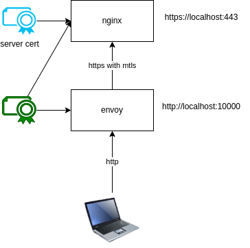

:toc:

== MTLS

create a mtls connection transparent for a client.

[source,bash]
----
./createCerts.sh
docker-compose up
browser https://localhost      # denied because of missing client-cert
browser http://localhost:10000 # envoy is handling the mtls
----

=== Doku

* Quick Start: https://www.envoyproxy.io/docs/envoy/latest/start/quick-start/run-envoy

[source,bash]
----
# einfach mal starten
docker run --rm \
      envoyproxy/envoy:dev-f97242a970eb6637b2aa8bba916f589672a1d190 \
          --version

# command line arguments hilfe ausgeben
docker run --rm \
      envoyproxy/envoy:dev-f97242a970eb6637b2aa8bba916f589672a1d190 \
          --help

# demo config
docker run --rm -it \
      --name envy \
      -p 9901:9901 \
      -p 10000:10000 \
      envoyproxy/envoy:dev-f97242a970eb6637b2aa8bba916f589672a1d190
# testing
curl -v localhost:10000
browser http://localhost:10000/
# admin ui
browser http://localhost:9901/
# print config
docker exec -it envy cat /etc/envoy/envoy.yaml
----

=== create certificate

[source,bash]
----
# create self-signed cert
openssl req -x509 -newkey rsa:4096 \
  -keyout nginx_key.pem \
  -out nginx_cert.pem \
  -sha256 \
  -days 3650 \
  -nodes \
  -subj "/C=XX/ST=StateName/L=CityName/O=CompanyName/OU=CompanySectionName/CN=CommonNameOrHostname"

# check
openssl pkey -in nginx_key.pem -pubout -outform pem | sha256sum
openssl x509 -in nginx_cert.pem -pubkey -noout -outform pem | sha256sum
----

=== use certificates in nginx

* https://faun.pub/setting-up-ssl-certificates-for-nginx-in-docker-environ-e7eec5ebb418

=== require mtls in nginx

* https://smallstep.com/hello-mtls/doc/server/nginx

=== configure mtls in envoy

* https://www.envoyproxy.io/docs/envoy/latest/start/sandboxes/double-proxy

